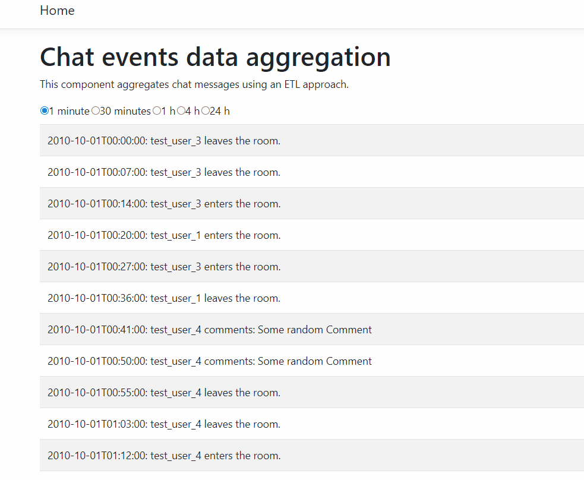

# React / .Net Core chat events data ETL aggregation

This is a sample application that fills a database model with chat events (enter, leave, coment, hi-five)

Transactions are summarized into aggregated data tables for each time frame that the application supports (15m, 30m, 1h, 4h, 24h) by a ETL (Extraction Transformation Loading) process

Both transactional and aggregated data is served through a .Net Core Web API service layer using Entity Framework

Data is pulled a visualized from a React front end which consumes the services

The idea behind this implementation is prioritizing performance over a flexibility (e.g. a method that would take any time span and produce aggregated data on the fly) as this approach processing time will grow exponentially by a factor of the transactions.

## Requirements

Visual Studio 2019 with .Net Core 3.0

Microsoft SQLServer

IIS Express

## Run

Create a database with a chosen name

run /SQL/data.sql on the newly created database

run /SQL/model.sql on the newly  created database

Modify ETLChatContext to use the connection string which points to the newly created database

Note: model.sql could take considerable time to run

This is how the final structure should look like:

Note Event_Agg tables. These tables contain aggregated data created by spETLProcessRun

## Running

Open etl-chat-app.sln from Visual Studio, build and run. This will install react dependencies using npm, start .Net Web API server and run ClientApp on IISExpress.

## Testing

Please refer to etl-chat-appTests which has been included in the project

